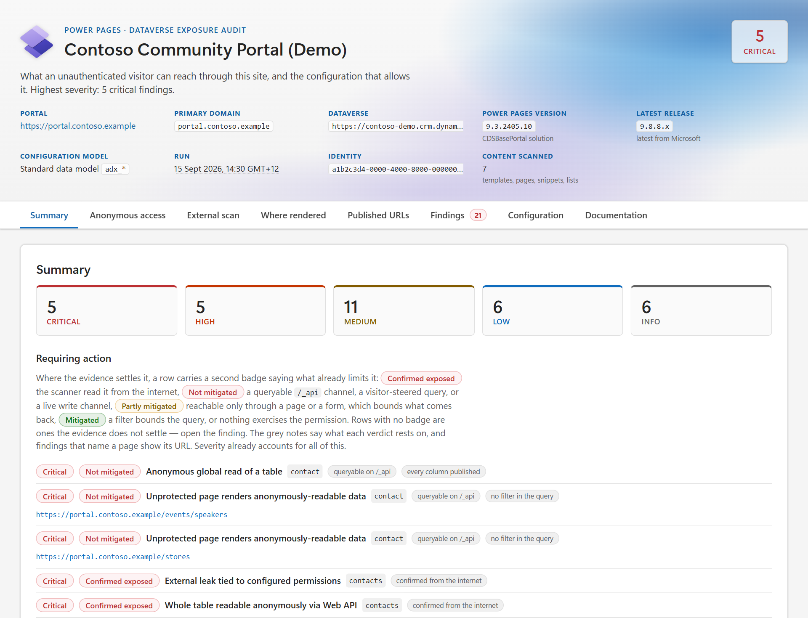
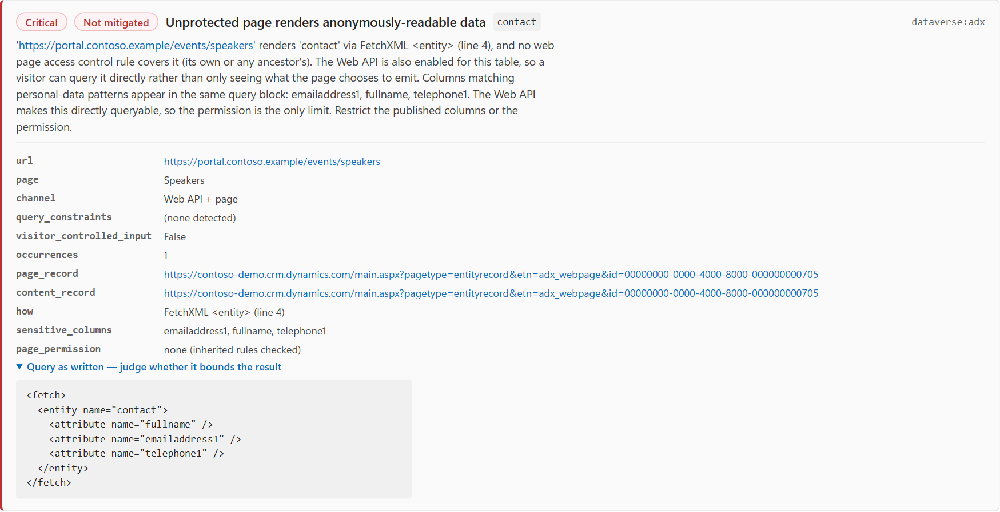
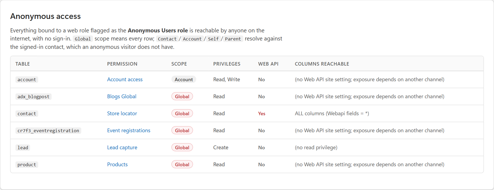
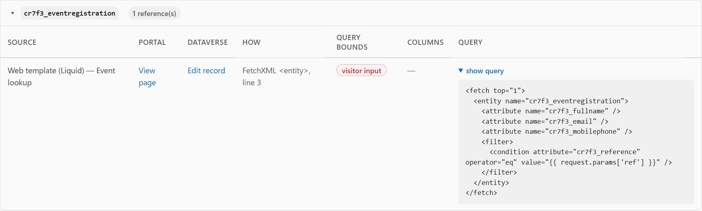
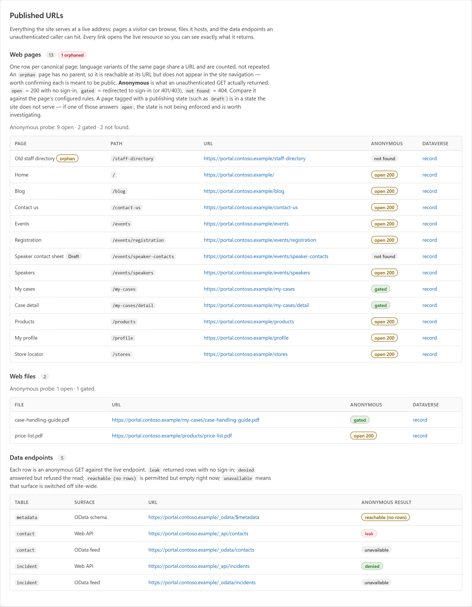
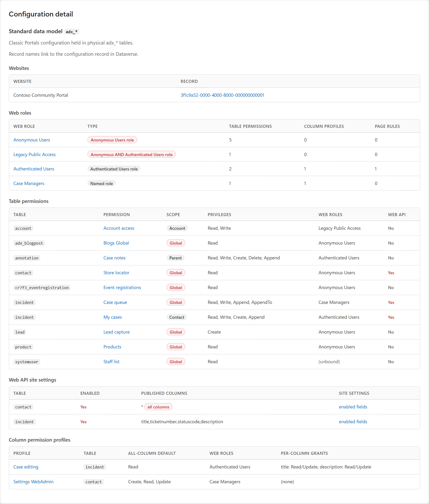

# ppaudit — Power Pages / Dataverse exposure audit (WIP)

A security auditing tool for Microsoft Power Pages (formerly Power Apps
Portals) and the Dataverse tables behind them. It answers one question two
ways: **what data can an unauthenticated visitor read, and why is it exposed?**

It is a reimplemented and extended clone of the
[power-pwn](https://github.com/mbrg/power-pwn) *Power Pages* module. Where
power-pwn does a black-box anonymous scan, `ppaudit` adds an authenticated,
inside-out audit of the actual permission model and correlates the two so every
external leak is tied to the configuration that causes it.

> Intended for authorised security testing of environments you own or are
> engaged to assess (pentest, breach investigation, internal audit). Only scan
> or authenticate against systems you have permission to test.



*Every screenshot in this README is of a fictional Contoso site — see
[Sample report](#sample-report).*

## The three parts

| Command | View | What it does |
| --- | --- | --- |
| `scan` | outside-in, anonymous | Probes the Power Pages site with no auth. |
| `audit` | inside-out, authenticated | Reads the Dataverse config that governs exposure. |
| `full` | both + correlation | Runs the scan, then the audit, then links each external leak to its root-cause permission. |
| `naming` | remediation helper | Proposes self-describing names for table permissions and column permission profiles. |

### `scan` — anonymous scanner (the improved clone)

Reproduces the power-pwn technique and extends it:

- Discovers exposed tables from `/_odata/$metadata` — and flags that the
  metadata is anonymously readable, since a public schema is itself an aid to
  an attacker.
- Also probes a **wordlist of high-value tables** directly, so a locked-down
  metadata document does not hide a still-leaking entity set.
- Checks **both** the `/_odata` feed and the `/_api` Web API surface.
- Reports **how many rows are reachable** (`$count`), not just yes/no.
- On a table-permission error (Web API code `90040101`), falls back to
  **per-column probing** to catch partial column-level leaks.
- Runs probes **concurrently**, with optional rate limiting for politeness. A
  probe that never gets an answer is recorded as untested rather than passed:
  where nothing answers at all, the scan says so instead of reporting a clean
  site.
- Optional `--header 'Cookie: ...'` re-runs the scan as an authenticated portal
  user, to compare the anonymous and signed-in surfaces.

### `audit` — authenticated Dataverse permission audit

Connects to the Dataverse Web API and reconstructs the exposure model:

- **Web roles** — which are the Anonymous Users and Authenticated Users roles.
- **Table permissions** (`adx_entitypermission` / `mspp_entitypermission`) —
  their scope (Global vs Contact/Account/Self/Parent), their privileges
  (read/write/create/delete/append), and the roles they bind to.
- **Web API site settings** — every `Webapi/<entity>/enabled` and
  `Webapi/<entity>/fields`.
- **Page permissions** — web page access control rules, resolved *through the
  page hierarchy* so inherited protection is not mistaken for an open page.
- **Publishing state** — pages and files in a non-visible state (stock: Draft)
  are not served to visitors, so they are reported as latent rather than live
  exposure: one publishing-state change away, which is routine content work
  rather than a security decision. Visibility is read from the state's Is
  Visible flag, since states can be renamed and added.
- **Rendered content** — Liquid web templates, page copy and scripts, content
  snippets and entity list FetchXML, to find which pages actually query a table.
- **Entity forms and web files** — the write channel, and published files that
  sit outside the table-permission model entirely.

It then performs the join those three make possible: **a page that renders a
table, with no page permission, behind an anonymous table permission**. That is
the shape of a Power Pages breach, and reviewing the three parts separately is
how sites leak in plain sight. Findings carry the URL to open and both Dataverse
records to edit.

It flags the dangerous combination directly: a permission granting **Read with
Global scope to the Anonymous Users role** means any visitor can read the whole
table — the exact pattern behind Power Pages data-exposure breaches. Anonymous
**write/create/delete** is escalated to critical regardless of scope.

Severity is a function of **channel × data class**, not of the permission alone:
a queryable endpoint over personal data is critical, while the same permission
on CMS content with no query channel is informational. Entity forms on
unprotected pages are reported as the write channel they are.

Both the classic `adx_` schema and the enhanced Power Pages `mspp_` data model
are supported; the tool detects which the environment uses.

### `full` — correlation

Runs `scan` then `audit`, then for each table the scanner read externally it
names the specific permission (scope, privileges, bound roles) that allows it —
or flags that no matching permission was found, meaning the leak comes through a
different channel (OData feed, entity list, or Liquid template) that warrants
manual review.

### `naming` — make the permission list readable

`adx_entityname` is the label a reviewer sees in the Portal Management app and
in these reports. Left to grow organically it becomes "Read", "Portal access",
"Global | list" — names that say nothing about which table is affected, what
scope applies, or what is granted. Reviewing the security model then means
opening every record.

`naming` rebuilds each name from the grant it describes:

```bash
python -m ppaudit naming                        # dry run: show the proposed names
python -m ppaudit naming --target permissions   # table permissions only
python -m ppaudit naming --target profiles      # column permission profiles only
python -m ppaudit naming --apply                # write them to Dataverse
```

```text
Account access (WebAdmin)   ->  account [R/W/A/A2] (Contact)
My cases                    ->  incident [R] (Contact)
Case notes                  ->  annotation [R/W/C/D/A] (Parent>Contact)
Blogs Global                ->  adx_blogpost [R] (Global) **ANON**
Public product details      ->  product [R] (Global) **ANON**
Staff list                  ->  systemuser [R] (Global) **ANON**
```

Privileges use the `R/W/C/D/A/A2` shorthand already common in portal
configuration, and the scope follows in parentheses. The table leads, so every
grant on a table sorts together and `(Global)` stands out.

`Parent` scope says nothing on its own — the reach is decided by the parent
table permission it chains to. The default template resolves that chain, which
is frequently the only thing separating "this contact's notes" from "every note
on the account":

```text
Case notes with scope to self         ->  annotation [R/W/C/D/A] (Parent>Contact)
Case notes where account is customer  ->  annotation [R/W/C/D/A] (Parent>Account)
```

Chains of any depth resolve, so an attachment hanging off a comment hanging off
a case reads `(Parent>Parent>Account)`.

Anything bound to an **Anonymous Users role** — the public internet — gets a
trailing `**ANON**`. It is appended after templating, truncation and
deduplication, so it is never the part that gets cut off a long name, and it
makes the public surface greppable in a record list that has no other way to
show it. Change it with `--anon-marker "<<PUBLIC>>"`, or switch it off with
`--anon-marker ""`.

That marker is the only thing role bindings contribute to a name. Which named
roles hold a permission is not a property of the grant, role names drift over
time, and one permission can carry several — so roles stay out of the name.

The convention is a template, since house styles differ:

```bash
python -m ppaudit naming --format "{table} [{privileges}] scope={scope_chain}"
```

Placeholders: `{table}` `{scope}` `{scope_chain}` `{root_scope}` `{parent}`
`{relationship}` `{privileges}` `{privileges_compact}` `{privileges_long}`
`{roles}` `{website}` `{name}`. Add `--only-unclear` to leave names that already
mention their table and scope.

Where two records still produce the same name, the group is disambiguated by
the first property that separates all of them — the scope its parent chain
resolves to, then the relationship it traverses, then the website. All are
intrinsic to the permission record.

Falling through to a `#1`/`#2` counter is itself a finding: the records are
identical in table, scope, chain, relationship *and* privileges, and differ only
by which roles they are bound to. That is usually one permission that should be
bound to both sets of roles rather than two records to keep in step.

#### Column permission profiles

`adx_columnpermissionprofile` gets the same treatment, with a shape suited to
what it controls:

```text
Account                                   ->  account [all:none] +columns
Edit User Profile                         ->  contact [all:R/U] +columns
Create User/Contact                       ->  contact [all:C/R/U] +columns
Settings WebAdmin (Create, Read, Update)  ->  incident [all:C/R/U]
```

`all:` is the profile's **all-column default** — what every column *not*
explicitly listed receives. The prefix is deliberate: bare `[R/U]` reads as
"this profile grants read and update", when it actually means "anything not
listed below gets read and update", which is the part that silently widens as
new columns are added to the table. `[all:none]` is the tight configuration;
`[all:C/R/U]` means the profile restricts nothing by default.

`+columns` says the profile has explicit per-column grants. Its **absence** is
the thing to look at: a profile with no column list applies only its all-column
default, so `incident [all:C/R/U]` above grants create, read and update on every
column of the table — including any added later.

Presence is flagged rather than counted on purpose. A count changes every time
someone edits a single grant, so the name would go stale constantly; going from
"no list at all" to "has a list" is a real change of intent. The count is still
available as `{columns}` / `{columns_label}` if you want it.

Profile placeholders: `{table}` `{permissions}` `{permissions_long}`
`{columns}` `{columns_label}` `{columns_flag}` `{roles}` `{website}` `{name}`.
Set with `--profile-format`.

> `--apply` is the only write this tool performs, and it only ever sets the
> name field. It is a dry run unless you pass the flag.

## Install

```bash
pip install -e .            # console entry point: ppaudit
pip install -e '.[yaml]'    # optional: PyYAML for instances.yaml (a fallback parser ships in-box)
```

Or without installing:

```bash
pip install -r requirements.txt
python -m ppaudit --help
```

Python 3.10+.

## Tests

```bash
pip install -e '.[dev]'
pytest                    # the offline suite; no network, no live environment
pytest -m network         # additionally verifies every Microsoft Learn link resolves
```

The fixtures are hand-built synthetic sites, so the suite is safe to run and
ship publicly. It covers the parts that fail silently rather than loudly:
parent-chain resolution, page-permission inheritance, column attribution
scoping, name truncation, and HTML escaping.

## Usage

The quickest start is to run it with nothing at all and answer the questions:

```bash
python -m ppaudit
```

It asks what to do (scan and audit, scan only, audit only, tidy names), which
site when `instances.yaml` lists more than one, and whether to save a report —
then prints the full command it is running, so you learn the flags as you go.
Any subcommand asks for whatever its flags leave out in the same way:
`python -m ppaudit scan` with two sites configured asks which one.

Prompts appear only at a terminal. Piped and scheduled runs (CI, an agent)
never prompt and audit every configured instance, as before. Choose sites up
front with `--instance NAME` (repeatable; the name or its slug), or suppress
questions from a terminal with `--no-input`.

The usual scripted way: describe the environments once in `instances.yaml`,
keep the secrets in `.env`, then run with no arguments.

```bash
python -m ppaudit full --markdown reports/audit.md --json reports/audit.json
```

Every instance in the file is audited in turn. Each one writes into its own
folder, created as needed, with the run time in the filename — so a later run
never replaces an earlier one and two sites never collide:

```text
reports/
  contoso-production/audit-20260916-142530.html
  contoso-test/audit-20260916-142530.html
```

`instances.yaml` (auto-discovered in the working directory, or `--instances PATH`):

```yaml
instances:
  - name: Contoso (Production)
    dataverse_url: https://contoso.crm.dynamics.com/
    portal_url: https://www.example.com
    # website: optional, restricts the audit to matching website names

tenant_id: ${tenant_id}
client_id: ${client_id}
client_secret: ${client_secret}
```

`${...}` placeholders resolve from the environment or a `.env` beside it
(matched case-insensitively), so the YAML is safe to commit:

```bash
tenant_id="..."
client_id="..."
client_secret="..."
```

URLs may still be passed directly, bypassing the config file:

```bash
# Anonymous scan, save an HTML report
python -m ppaudit scan --url contoso.powerappsportals.com --html report.html

# Authenticated permission audit
python -m ppaudit audit --org-url https://contoso.crm.dynamics.com --json audit.json

# Everything, correlated
python -m ppaudit full \
    --url contoso.powerappsportals.com \
    --org-url https://contoso.crm.dynamics.com \
    --html report.html --json report.json
```

### Authentication (app registration / client credentials)

Authenticated commands use Azure AD client credentials. Provide them in
`instances.yaml` + `.env` (preferred), by env var, or by flag:

```bash
export TENANT_ID=...        # or --tenant-id
export CLIENT_ID=...        # or --client-id
export CLIENT_SECRET=...    # or --client-secret
```

The app registration must be added to the target environment as an
**Application User** with a security role that can read the Power Pages
configuration tables (System Administrator, or a custom role with read on the
`adx_*` / `mspp_*` config entities plus `WhoAmI`). Setup:

1. Azure AD → App registrations → new registration; create a client secret.
2. In the Power Platform admin centre, add that app as an Application User in
   the target environment and assign it a read-capable security role.
3. `--org-url` is the environment URL (`https://<org>.crm.dynamics.com`).

## Output

Every command prints a severity-ranked summary to the console and can also
write:

- `--markdown PATH` — **the reviewable document**: executive summary, the
  anonymous surface, the external scan, then the full configuration inventory
  (web roles, table permissions, column permission profiles and their per-column
  grants, Web API site settings, OData feeds, page access rules, security site
  settings), every finding, and a reviewer checklist.
- `--json PATH` — full findings + context, for diffing audits over time.
- `--html PATH` — a shareable, theme-aware report.

The path you give is a template, not the final name: the instance slug becomes a
folder under it and the run time is added to the stem, so `--json
reports/audit.json` lands at `reports/<instance>/audit-<YYYYMMDD-HHMMSS>.json`.
Reports are evidence of how a site looked at a moment, so nothing is overwritten
and the history is kept. A target given as a bare `--url` / `--org-url` is named
after its host.

Where the evidence settles it, a summary line carries a second badge saying what
already limits the finding — **Confirmed exposed** (the scanner read it from the
internet), **Not mitigated** (a queryable `/_api` channel, a visitor-steered
query, or a live write channel), **Partly mitigated** (reachable only through a
page or a form, which bounds what comes back), or **Mitigated** (a filter bounds
the query, or nothing exercises the permission). Findings whose evidence does not
settle the question carry no badge rather than a reassuring guess. Each line also
carries the reason in short form (`queryable on /_api`, `bounded by a FetchXML
filter`, `no filter in the query`), and findings that name a page show its URL.
Severity already accounts for all of it; the badge is there so a page of red does
not stop a reader on the first line.

Exit code is non-zero when any finding is **High** or above, so the tool can
gate a CI pipeline.

### Sample report

[`mockup/sample_report.html`](mockup/sample_report.html) (with matching
[Markdown](mockup/sample_report.md) and [JSON](mockup/sample_report.json)) is
the output for a fictional Contoso site. Download the HTML and open it to explore
every tab.

The headline finding: a public page renders personal data, no page permission
covers it, and the Web API makes the table directly queryable. The finding
carries the live URL, both Dataverse records to edit, and the query as written.



**Anonymous access** lists everything bound to an Anonymous Users role — scope,
privileges, and which columns the Web API actually publishes.



**Where rendered** traces each table to the template or page that queries it,
and flags queries a visitor can steer through request parameters.



**Published URLs** records what an anonymous request to each page, file and data
endpoint actually returned, next to the configuration that should govern it.



**Configuration** is the inventory a reviewer checks against intent: web roles and
what each carries, every table permission with its scope and bound roles, the Web
API site settings, and the column permission profiles. Record names link straight
to the Dataverse record.



The site is invented and nothing real is contacted: the configuration is fed
through the real audit and report code with only the network calls stubbed. To
regenerate after changing a renderer:

```bash
python mockup/build_mockup.py   # sample_report.html / .md / .json
python mockup/capture.py        # screenshots into mockup/_img/ (needs playwright + Chrome)
```

## How exposure actually works (reference)

A Power Pages table read by an anonymous visitor requires, together:

1. a channel that serves the table — the Web API
   (`Webapi/<entity>/enabled = true`, queried at `/_api/<entityset>`), the
   `/_odata` feed, an entity list, or a Liquid `fetchxml`/`entityview`; **and**
2. a **table permission** granting `read`; **and**
3. that permission bound to a **web role flagged as the Anonymous Users role**;
4. with **Global scope** — Global means all rows. Contact/Account/Self/Parent
   scope resolves against the signed-in user, which anonymous visitors lack, so
   those usually return nothing (but are worth reviewing for scope misuse).

`ppaudit audit` inspects 1–4 from inside; `ppaudit scan` proves the result from
outside; `ppaudit full` connects them.

## Layout

```text
ppaudit/
  constants.py   endpoints, error codes, config schema (adx_ + mspp_), scope map
  config.py      .env + instances.yaml loading and placeholder resolution
  anonscan.py    anonymous outside-in scanner (OData + Web API, concurrent)
  dataverse.py   authenticated Web API client (client-credentials auth)
  model.py       typed configuration model, read per generation
  references.py  finds where Liquid/FetchXML/page scripts render a table
  audit.py       permission-model audit + external-leak correlation
  naming.py      proposed naming convention for permissions and column profiles
  docs.py        Microsoft Learn references per finding type (links only)
  report.py      findings model; console / JSON renderers
  markdown.py    the Markdown review document
  htmlreport.py  the Fluent 2 HTML report
  pageprobe.py   anonymous reachability probe of published URLs and endpoints
  versions.py    Microsoft's published release list, for the version comparison
  prompts.py     terminal prompts for anything the command line left unsaid
  cli.py         argparse CLI (scan | audit | full | naming)
skills/
  powerpages-exposure-audit/   agent skill: run, interpret, remediate
mockup/
  build_mockup.py  builds the sample reports from a fictional site
  capture.py       screenshots the sample HTML report for this README
```

## Agent skill

`skills/powerpages-exposure-audit/SKILL.md` teaches an AI agent to run the tool,
read its output, and plan remediation — including the exposure chain, the
severity model, how to query the JSON, and the remediation order of preference.

Install it by copying the folder into your agent's skills directory:

```bash
cp -r skills/powerpages-exposure-audit ~/.agents/skills/
```

## Licence

MIT — see [LICENSE](LICENSE).
